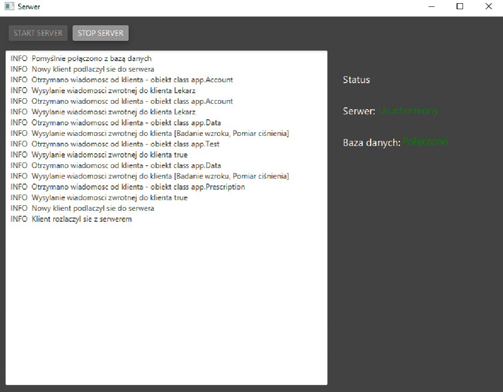

# Hospital Service System
Hospital service system. App developed in 2022.

## Description

Application designed in client-server model for doctors and nurses. It allows to record clinical examinations, browse the archive and create prescriptions.

## Technologies Used
### Languages
- Java
- SQL
### Libraries
- javaFx 17.0.1 – GUI
- jfoenix 9.0.10 – GUI addons
- jUnit 4.13.2 – testing
- log4j 1.2.17 – logs
- mariadb 2.7.4 - database

## Example Screenshots
### Menu

### Blood Pressure Measurement

### Server panel

